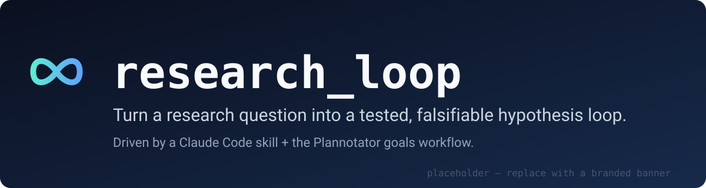
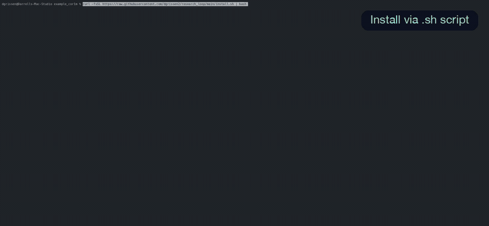

<!-- 1. HERO — centered banner with name+tagline baked in (replace assets/hero.svg with a branded banner) -->
<p align="center">
  
</p>

<!-- 2. VALUE PROP (one-line TL;DR; the full pitch is "Research on Autopilot" below) -->
<p align="center">
  Automate the rigor of hypothesis-driven research — <b>autonomously</b>, with <b>Claude</b> personas and their <b>Codex</b> twins playing off each other.
</p>

<!-- 3. BADGES — ~4, centered, each links. (Add a CI status badge once a workflow exists.) -->
<p align="center">
  <a href="CHANGELOG.md"></a>
  <a href="#license"></a>
  <a href="framework/docs/GETTING_STARTED.md"></a>
  <a href="#install"></a>
</p>

<!-- 4. DEMO — highest-leverage element, right after badges (replace with a vhs-generated GIF) -->
<p align="center">
  
  <br>
  <sub><i>▶ <a href="assets/demo.mp4">Watch the walkthrough (MP4)</a></i></sub>
</p>

---

## Research on Autopilot

The trouble with AI research and data analysis is that it's confident, fast, and easy to fake — a plausible
conclusion that was never actually tested and that no one can reproduce, because a single model left in a
loop just talks itself into a tidy story. **research_loop** exists to make **rigorous research the default**
instead. It automates the discipline of a hypothesis-driven approach, **autonomously**: a panel of expert
personas reason in **Claude**, each paired with an independent **Codex** twin that reviews and pushes back, so
no model ever grades its own work. Code guardrails enforce the method — a Python gate reads the artifacts on
disk and refuses to close a round until every step is done, so nothing gets skipped. And it compounds: after
each round the panel proposes new hypotheses, expanding on what it just found. research_loop produces fully
documented, **falsifiable, reproducible, and auditable** results — and it can run autonomously for hours at a
time and produce **genuinely novel** results.

## Why it exists

The approach is inspired by Andrej Karpathy's autonomous **[agent loop](https://thenewstack.io/karpathy-autonomous-experiment-loop/)**
— an LLM that optimized an ML run overnight toward a single, human-set metric. That's brilliant for a
**bounded** objective, but it drifts on **unbounded** research questions, where there's no one number to climb.
research_loop keeps that autonomy and adds what open-ended research actually needs: an adversarial second
model, and a gate that enforces the method.

| Without research_loop | With research_loop |
|---|---|
| Conclusions live in chat scrollback | One findings note per claim, with a verdict and a decision |
| "It looks like X" — no pass/fail | Falsifiable claim + explicit pass criteria + a single verdict |
| Can't tell signal from coincidence | Threats-to-validity check; honest negatives recorded |
| No trail from result → code/data | Everything backlinked: note ↔ index ↔ goal ↔ scripts/data/outputs |
| One model's blind spots | Optional independent cross-model review (Codex / Gemini) |
| Results get overwritten | Stable IDs, immutable outcomes — new evidence is appended |

## Features

| Feature | Invoke | What it does |
|---|---|---|
| **Scope a research goal** | `/plannotator-setup-goal` | idea → "seed ideas" → round cap → a goal package |
| **Run the loop** | `/goal goals/<slug>/goal.md` | executes each hypothesis → findings note + index row + memo |
| **Maintain the record** | the `research-hypothesis-maintainer` skill | classification, stable IDs, promotion, backlinks, round cap |
| **Cross-model review** *(optional)* | `/codex-strategy-review <note>` | an independent model stress-tests a finding (falls back to Gemini / in-Claude) |
| **Add a reviewer persona** | ask the skill to add one | interview → optional web research → synthesize a persona avatar |

> [!WARNING]
> **research_loop is heavy on AI/agent usage — plan accordingly.** A single program runs multi-persona
> panels, optional cross-model (Codex) twins, and multiple rounds, which adds up to *many* model calls (the
> Phase 6 & 8 panels are **N personas × 2 passes** when a cross-model twin is enabled). If you are **not on a
> high/"max" plan, dial it down:**
> - **Skip Codex** at install (answer *no* to the Codex prompt) — the loop still completes with the in-Claude panel only.
> - **Lower the reasoning effort:** for Codex, set `--effort` / `DEFAULT_EFFORT` from `xhigh` → `medium`/`low` (see `framework/codex/README.md`); for Claude, use a lighter model / lower thinking for the panels.
> - **Start small:** fewer personas, a smaller round cap.
>
> Treat **`xhigh` + Codex + many rounds + several personas** as the *max-plan* configuration, not the default expectation.

## Install

research_loop scopes its goals through **[Plannotator](https://github.com/backnotprop/plannotator)** (a visual plan/diff review tool for coding agents) — **install Plannotator first:**

```bash
curl -fsSL https://plannotator.ai/install.sh | bash
```

Then wire it into Claude Code: `/plugin marketplace add backnotprop/plannotator` → `/plugin install plannotator@plannotator` → restart Claude Code. (See the [Plannotator repo](https://github.com/backnotprop/plannotator) for other agents / manual setup.)

**Then add research_loop** — paste this in the project you want to add it to (macOS / Linux / WSL):

```bash
curl -fsSL https://raw.githubusercontent.com/dgrissen2/research_loop/main/install.sh | bash
```

Then, in Claude Code, run the skill the installer set up:

```text
/plannotator-setup-goal      # scope your first research goal
```

<details>
<summary>Pin a version, read before running, or install globally</summary>

```bash
# Read the script first (recommended for any curl|bash):
curl -fsSL https://raw.githubusercontent.com/dgrissen2/research_loop/main/install.sh -o install.sh && less install.sh && bash install.sh

# Pin to a tag/commit instead of main:
curl -fsSL https://raw.githubusercontent.com/dgrissen2/research_loop/<ref>/install.sh | bash

# Or clone and run locally (you choose project-local vs global at the prompt):
git clone git@github.com:dgrissen2/research_loop.git
./research_loop/install.sh /path/to/project
```

The installer is idempotent, asks before each optional step (Codex review skills, Plannotator), and
never assumes anything is installed.
</details>

## Quickstart

```text
1.  curl -fsSL .../install.sh | bash      # installs the skill, personas, templates, work folders
2.  /plannotator-setup-goal               # idea → seed hypotheses + a round cap → a goal package
3.  /goal goals/<slug>/goal.md            # run the loop: findings notes + index + decision memo
```

Then read `hypothesis_tracking/RESEARCH_HYPOTHESIS_INDEX.md` and the decision-maker memo. Full walkthrough:
**[docs/GETTING_STARTED.md](framework/docs/GETTING_STARTED.md)**.

## How it works

1. **Scope** — `/plannotator-setup-goal` turns a question into a goal: seed ideas, an agreed round cap, and an initial set of hypotheses (confirmed with you).
2. **Define** — each idea is classified as a hypothesis (a standalone, decision-changing claim) or an experiment (a sub-question).
3. **Test** — method + sample integrity, then analysis (code in `scripts/`, results in `outputs/`).
4. **Judge** — one verdict (`supported` … `inconclusive`), a threats-to-validity check, and a decision impact.
5. **Review** — the confirmed persona panel comments on the finding (optionally via an independent model).
6. **Propose** — the panel reviews the round's evidence and proposes new hypotheses + follow-up experiments, synthesized into the next round's backlog.
7. **Record & iterate** — write the note, update the index with backlinks; repeat until the round cap, then write the decision-maker memo.

See **[docs/RESEARCH_PROCESS.md](framework/docs/RESEARCH_PROCESS.md)** for the full, versioned process.

## Reliability & execution

The back half is **enforced by code, not by the agent's context memory**: a Claude Code **Stop hook** runs
`verify_round.py`, which reads the on-disk artifacts and refuses to close a round until the work is provably
complete. The producers are built to be crash-safe and reproducible:

- **Locked & atomic.** Each producer run takes a per-project `flock` (sole writer) and writes every
  artifact via temp-file + atomic rename, so an interrupted or concurrent run never leaves a torn JSON file.
- **`claude_leg: subprocess | subagent`.** The Claude persona leg runs either as `claude -p` subprocesses
  (the default — headless / CI-capable) or as native in-session Claude Code subagents. The `prompts` →
  `assemble` modes make the two paths emit **byte-identical** artifacts, so the gate sees no difference.
  (Subagents need an interactive session; keep `subprocess` for headless runs.)

See the **[System & User Guide](framework/docs/SYSTEM_AND_USER_GUIDE.md)** for the full mechanics.

## Docs

- **[Getting Started](framework/docs/GETTING_STARTED.md)** — your first loop in 5 minutes.
- [Research Process](framework/docs/RESEARCH_PROCESS.md) — the full loop, versioned, with guardrails.
- [Using with Plannotator](framework/docs/USING_WITH_PLANNOTATOR.md) — the goals-driven workflow in detail.
- [System & User Guide](framework/docs/SYSTEM_AND_USER_GUIDE.md) — how the scripts + Stop-hook gate enforce the back half.
- [Importing into another project](docs/IMPORTING.md) — install and drive research_loop from a separate repo.
- [Changelog](CHANGELOG.md) — version history (this is **1.1.0**).
- **Worked example:** `examples/cor1m-concentration-hedge/` — a complete, **dogfooded** study on real public data: *is COR1M's "over-bulled" low tail (extreme implied correlation) a usable hedge trigger?* **5 hypotheses across a 2-round program** (round cap 7, converged early at round 2), with multi-persona panels + cross-model (Codex) reviews. The result is honest and nuanced: the sub-8 flag roughly **doubles** the near-term drawdown-breach rate but isn't statistically significant (~8 episodes, one regime), and it adds edge beyond VIX **only for the concentrated index (QQQ)** → program verdict **weak_support**, decision **hold research-only** (a small, QQQ-skewed hedge *watch-flag*, not a sized trigger). (The loop producing a disciplined, regime-bound *negative* — not a forced win.)

## License

Licensed under the [MIT License](LICENSE-MIT).

## Contributing

Issues and PRs welcome. Unless you state otherwise, contributions you submit are licensed under the MIT
License as above.
